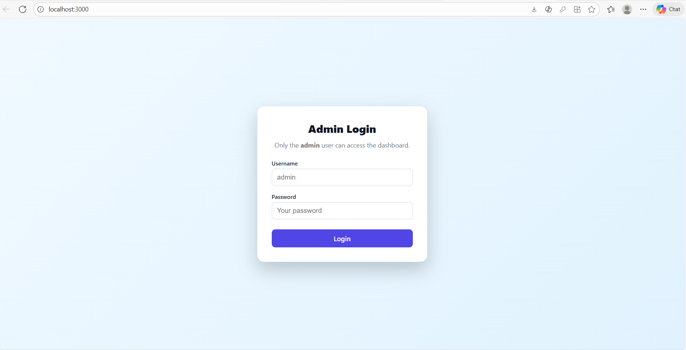
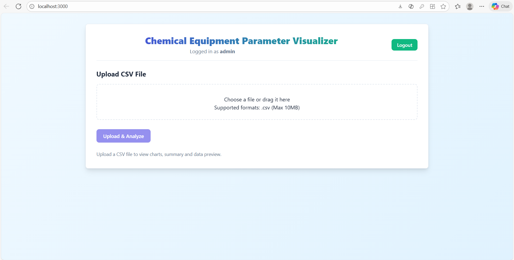
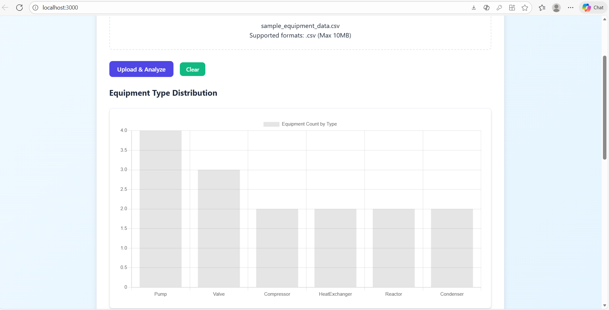
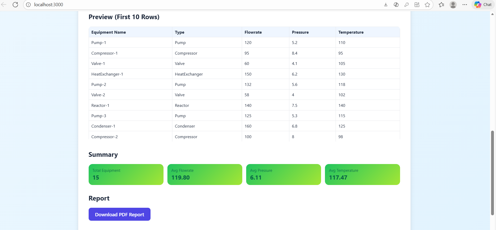
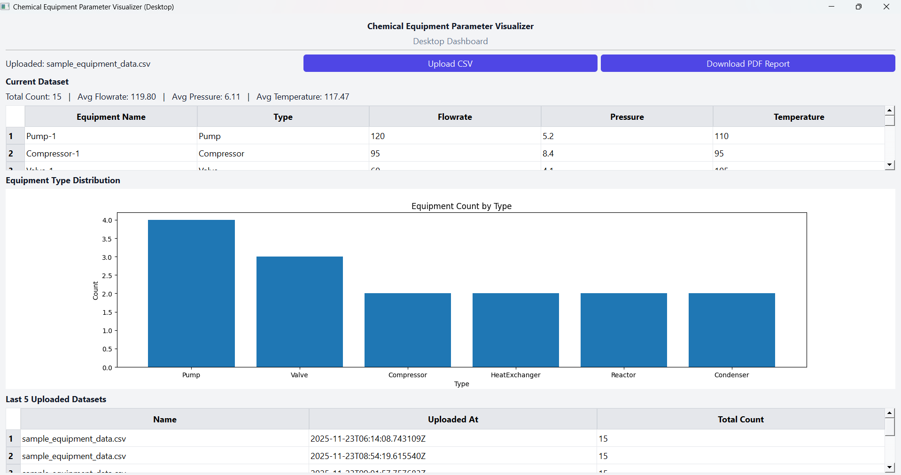

# Chemical Equipment Parameter Visualizer

Hybrid Web + Desktop Application

A powerful analytics system for chemical equipment datasets with Django REST API + React Web App + PyQt5 Desktop App, built for the Intern Screening Task.

# Overview

The Chemical Equipment Parameter Visualizer enables users to:

Upload CSV files containing equipment data

View data summaries, preview tables, and charts

Download auto-generated PDF reports

Access last 5 uploaded datasets

Use both Web and Desktop applications powered by a shared Django backend

This project showcases API integration, data processing, visual analytics, desktop development, and authentication—all in one solution.

# Tech Stack
Backend	--> Django, Django REST Framework	
Database --> SQLite	
Web Frontend --> React.js, Axios, Chart.js	
Desktop App --> PyQt5, Matplotlib	
Data Processing	--> Pandas	
PDF	--> ReportLab	
Auth --> Basic Authentication	
Version Control	--> Git & GitHub	

# Project Structure
chemical-equipment-visualizer/
│
├── backend/
│   ├── chemviz/                  # Django project settings
│   ├── api/                      # DRF app (models, views, serializers, urls)
│   ├── db.sqlite3
│   ├── manage.py
│   └── requirements.txt
│
├── web-frontend/
│   └── chemviz-web/              # React web app
│       ├── src/App.js
│       ├── src/App.css
│       └── public/
│
└── desktop-frontend/
    ├── main.py                   # PyQt5 desktop app
    └── venv/                     # Optional virtual environment

# Setup Instructions

1.Backend (Django)
cd backend
python -m venv venv
venv\Scripts\activate     # Windows
pip install -r requirements.txt
python manage.py migrate
python manage.py createsuperuser
python manage.py runserver

Backend will run at:
 http://127.0.0.1:8000/api/

2.Web Frontend (React)
cd web-frontend/chemviz-web
npm install
npm start

Starts at → http://localhost:3000/

3️.Desktop App (PyQt5)
cd desktop-frontend
python -m venv venv
venv\Scripts\activate
pip install PyQt5 requests matplotlib
python main.py

# Features
-> CSV Upload
    Columns required:
    Equipment Name
    Type
    Flowrate
    Pressure
    Temperature

-> Data Summary
    Total equipment count
    Avg flowrate
    Avg pressure
    Avg temperature
    Equipment type distribution

-> Visualizations
    Web: Chart.js bar charts
    Desktop: Matplotlib charts

-> Preview Table
    Displays first 10 rows of the dataset.

-> Last 5 Datasets
    Stored in SQLite database.

-> PDF Report
    Downloadable via:
        Web UI
        Desktop UI

-> Authentication
    Uses Django Basic Auth
    Only admin users can access data.

# Screenshots

### Web Dashboard

### Desktop App
    
    